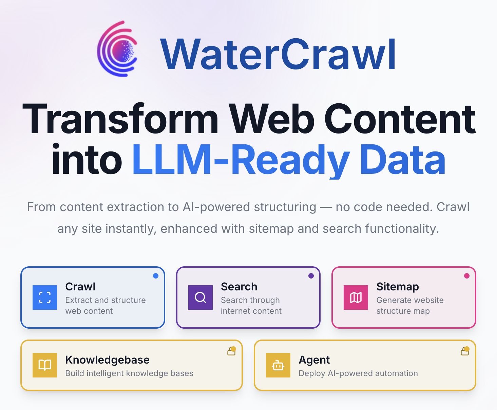

<div align="center">

[](https://watercrawl.dev)
[](https://watercrawl.dev/pricing)
[](https://github.com/watercrawl/watercrawl/releases)
[](https://github.com/watercrawl/watercrawl/actions)
[](https://hub.docker.com/r/watercrawl/watercrawl)
[](https://github.com/watercrawl/watercrawl/stargazers)
[](https://github.com/watercrawl/watercrawl/issues)
[](https://www.python.org/downloads/)

</div>


🕷️ WaterCrawl is a powerful web application that uses Python, Django, Scrapy, and Celery to crawl web pages and extract relevant data.

## 🚀 Quick Start

1. 🐳 [Quick start](#-quick-start)
2. 💻 [Development **(For Contributing)**](./CONTRIBUTING.md)

### 🐳 Quick start

To build and run WaterCrawl on Docker locally, please follow these steps:

1. Clone the repository:
    ```bash
    git clone https://github.com/watercrawl/watercrawl.git
    cd watercrawl
    ```

2. Build and run the Docker containers:
    ```bash
    cd docker
    cp .env.example .env
    docker compose up -d
    ```

3. Access the application with open [http://localhost](http://localhost)

> **⚠️ IMPORTANT**: If you're deploying on a domain or IP address other than localhost, you MUST update the MinIO configuration in your .env file:
> ```bash
> # Change this from 'localhost' to your actual domain or IP
> MINIO_EXTERNAL_ENDPOINT=your-domain.com
> 
> # Also update these URLs accordingly
> MINIO_BROWSER_REDIRECT_URL=http://your-domain.com/minio-console/
> MINIO_SERVER_URL=http://your-domain.com/
> ```
> Failure to update these settings will result in broken file uploads and downloads. For more details, see [DEPLOYMENT.md](./DEPLOYMENT.md).

> **Important:** Before deploying to production, ensure that you update the `.env` file with the appropriate configuration values. Additionally, make sure to set up and configure the database, MinIO, and any other required services. for more information, please read the [Deployment Guide](./DEPLOYMENT.md).


### 💻 Development (For Contributing)

For local development and contribution, please follow our [Contributing Guide](./CONTRIBUTING.md) 🤝

<div align="">
   <a href="https://watercrawl.dev/jobs">
      
   </a>
</div>

## ✨ Features

### Core Capabilities
- **🕸️ Advanced Web Crawling & Scraping** - Crawl websites with highly customizable options for depth, speed, and targeting specific content
- **🔍 Powerful Search Engine** - Find relevant content across the web with multiple search depths (basic, advanced, ultimate)
- **🌐 Multi-language Support** - Search and crawl content in different languages with country-specific targeting
- **⚡ Asynchronous Processing** - Monitor real-time progress of crawls and searches via Server-Sent Events (SSE)
- **🔄 REST API with OpenAPI** - Comprehensive API with detailed documentation and client libraries
- **🔌 Rich Ecosystem** - Integrations with Dify, N8N, and other AI/automation platforms
- **🏠 Self-hosted & Open Source** - Full control over your data with easy deployment options
- **📊 Advanced Results Handling** - Download and process search results with customizable parameters

### AI Agent Capabilities 🆕
- **📚 Knowledge Base Management** - Create and manage intelligent knowledge bases from your data sources with AI-powered indexing and retrieval
- **🤖 Custom Agent** - Deploy custom AI agents tailored to your specific workflows with intelligent decision-making capabilities
- **🔧 MCP Tools Integration** - Extend functionality with Model Context Protocol tools and custom integrations
- **🌐 HTTP Calls as Tools** - Convert any HTTP API into callable tools for your AI agents and workflows
- **🔗 Connect Knowledge Base to Agents** - Link knowledge bases directly to AI agents for enhanced context and intelligent responses
- **🎯 Use Agent as Tool** - Compose complex workflows by using agents as tools within other agents for hierarchical task delegation

Check our [API Overview](https://docs.watercrawl.dev/intro) to learn more about these features.

## 🛠️ Client SDKs

- ✅ [**Python Client**](https://docs.watercrawl.dev/clients/python) - Full-featured SDK with support for all API endpoints
- ✅ [**Node.js Client**](https://docs.watercrawl.dev/clients/nodejs) - Complete JavaScript/TypeScript integration
- ✅ [**Go Client**](https://docs.watercrawl.dev/clients/go) - Full-featured SDK with support for all API endpoints
- ✅ [**PHP Client**](https://docs.watercrawl.dev/clients/php) - Full-featured SDK with support for all API endpoints
- 🔜 [**Rust Client**](https://docs.watercrawl.dev/clients/rust) - Coming soon

## 🔌 Integrations

- ✅ [Dify Plugin](https://marketplace.dify.ai/plugins/watercrawl/watercrawl) ([source code](https://github.com/watercrawl/watercrawl-dify-plugin))
- ✅ [N8N workflow node](https://www.npmjs.com/package/@watercrawl/n8n-nodes-watercrawl) ([source code](https://github.com/watercrawl/n8n-nodes-watercrawl))
- ✅ [Dify Knowledge Base](https://dify.ai/)
- 🔄 Langflow (Pull Request - Not Merged yet)
- 🔜 Flowise (Coming soon)

## 🔧 Plugins

- ✅ WaterCrawl plugin
- ✅ OpenAI Plugin

## ⭐ Star History

[](https://star-history.com/#watercrawl/watercrawl&Date)

## 🔒 Security Disclosure

⚠️ Please avoid posting security issues on GitHub. Instead, send your questions to support@watercrawl.dev and we will provide you with a more detailed answer.

## 📄 License

This repository is available under the [WaterCrawl License](LICENSE), which is essentially MIT with a few additional restrictions.

---
<div align="center">
Made with ❤️ by the WaterCrawl Team
</div>