# ObjectiveCrawler: Comprehensive Workflow Diagram

## 🎯 Project Overview
**ObjectiveCrawler** is an intelligent web crawling system that fulfills user objectives by combining search strategies, content analysis, and multiple specialized LLMs. It can work with both company names (search-based) and direct URLs (sitemap-based).

---

## 📋 High-Level Workflow (from README.md)

The project follows this streamlined 8-step process:

```
👤 User Input (Company Name or Website URL + Objective)
        ⬇️
 🧠 Generate Diverse Search Strategies via LiteLLM (Search LLM)
        ⬇️
🕸️ Fetch Search Results with WaterCrawl
        ⬇️
🔍 Filter & Rank Relevant URLs using Rank-BM25
        ⬇️
🔍 Refine Ranking of URLs using LiteLLM (Ranking LLM)
        ⬇️
📄 Scrape Content from Top URLs (WaterCrawl)
        ⬇️
🤖 Analyze Content for Relevance (Content Analysis with LLM)
        ⬇️
📌 Compile Results into Structured JSON Response (Reasoning with LLM)
        ⬇️
✅ Deliver Final Outcome with Fulfillment Status and References
```

---

## 🏗️ Detailed System Architecture

```mermaid
graph TB
    subgraph "Entry Point"
        A[main.py] --> B[Parse CLI Arguments]
        B --> C[Initialize ObjectiveCrawler]
    end
    
    subgraph "Core Components"
        C --> D[ObjectiveCrawler.run()]
        D --> E{Input Type?}
        E -->|Company Name| F[Search-Based Flow]
        E -->|Direct URL| G[Sitemap-Based Flow]
    end
    
    subgraph "LLM Clients (clients.py)"
        H[Search LLM<br/>Query Generation]
        I[Ranking LLM<br/>URL Prioritization]
        J[Content Analysis LLM<br/>Page Analysis]
        K[Reasoning LLM<br/>Final Synthesis]
    end
    
    subgraph "WaterCrawl Integration"
        L[WaterCrawler Client]
        M[Search API]
        N[Scrape API]
        O[Sitemap API]
    end
```

---

## 🔄 Detailed Workflow Process

### Phase 1: Initialization & Strategy Generation


### Phase 2: URL Collection & Filtering


### Phase 3: URL Ranking & Selection


### Phase 4: Content Crawling & Analysis


### Phase 5: Final Synthesis & Output

```mermaid
flowchart TD
    A[All Individual Analyses] --> B[Reasoning LLM]
    B --> C[Synthesize All Findings]
    C --> D[Generate Final Answer]
    D --> E[Create JSON Output]
    E --> F[Include Metadata & References]
    F --> G[Return Complete Result]
    
    G --> H[JSON Structure:]
    H --> I[• objective_fulfilled: bool]
    I --> J[• final_answer: string]
    J --> K[• reference_urls: array]
    K --> L[• pages_analyzed: int]
    L --> M[• _metadata.individual_analyses]
```



---

## 🧠 LLM Specialization Strategy

| LLM Client | Purpose | Input | Output |
|------------|---------|-------|--------|
| **Search LLM** | Query Generation | Company + Objective | Multiple search strategies |
| **Ranking LLM** | URL Prioritization | URLs + Objective | Ranked URL list with scores |
| **Content Analysis LLM** | Page Analysis | Markdown + Objective | Structured content analysis |
| **Reasoning LLM** | Final Synthesis | All analyses + Objective | Final comprehensive answer |

---

## 🔧 Key Technical Components

### 1. **BM25 Filtering System**
```python
# Combines URL, title, description for relevance scoring
corpus = [f"{url} {title} {description}" for result in search_results]
bm25 = BM25Okapi(tokenized_corpus)
scores = bm25.get_scores(query_tokens)
```

### 2. **Multi-Model Configuration**
```python
# Different models for different tasks
search_gpt = LLMClient(model_name=search_model)
ranking_gpt = LLMClient(model_name=ranking_model)  
reasoning_gpt = LLMClient(model_name=reasoning_model)
content_analysis_gpt = LLMClient(model_name=content_analysis_model)
```

### 3. **WaterCrawl Integration**
```python
# Three main API endpoints used
results = wc.search(query, result_limit, search_options)
urls = wc.sitemap_full(company_url)  
content = wc.scrape(page_url)
```

---

## 📊 Data Flow Architecture


---

## 🎛️ Configuration & Customization

### CLI Parameters
- `--search-model`: LLM for query generation
- `--ranking-model`: LLM for URL ranking  
- `--reasoning-model`: LLM for final synthesis
- `--content-analysis-model`: LLM for page analysis
- `--strategies N`: Number of search strategies
- `--top-k N`: Number of URLs to crawl
- `--debug`: Enable detailed logging

### Search Options
- `depth`: basic/advanced/ultimate
- `language`: Language code (en, fr, etc.)
- `country`: Country code (us, fr, etc.)
- `result_limit`: Max results per query

---

## 🚀 Execution Flow Summary

1. **Input Processing**: Parse company/URL + objective
2. **Strategy Generation**: Create targeted search queries (if company)
3. **URL Discovery**: Search API or sitemap extraction
4. **Relevance Filtering**: BM25 + deduplication
5. **Intelligent Ranking**: LLM-based URL prioritization
6. **Content Extraction**: Parallel scraping of top URLs
7. **Content Analysis**: Per-page objective fulfillment analysis
8. **Final Synthesis**: Comprehensive answer generation
9. **Structured Output**: JSON with results + metadata

---

## 💡 Key Features

- **Multi-LLM Architecture**: Specialized models for different tasks
- **Intelligent Filtering**: BM25 + LLM ranking for relevance
- **Flexible Input**: Company names or direct URLs
- **Comprehensive Analysis**: Individual + synthesized results
- **Debug Mode**: Detailed logging and progress tracking
- **Error Handling**: Graceful failures with fallback responses
- **Metadata Preservation**: Full transparency of analysis process

---

*This workflow enables intelligent, objective-driven web crawling that combines the power of modern LLMs with robust search and scraping capabilities.*
