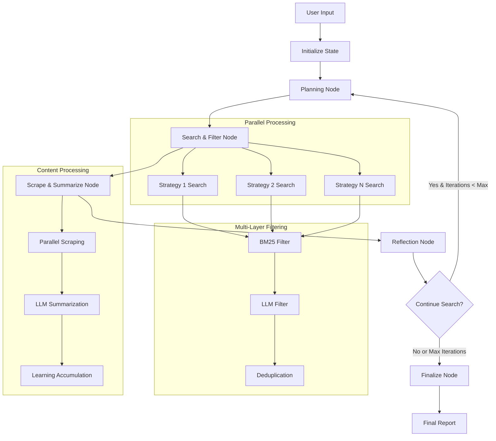

# 🔍 Intelligent Multi-Agent Search System: Bridging LLMs with Real-Time Web Intelligence

> *"In the age of AI, the most powerful systems are not those that know everything, but those that can learn anything."*

## 📖 Introduction: The Quest for Dynamic Knowledge

Imagine having a research assistant that never sleeps, never gets tired, and can simultaneously explore dozens of different angles on any topic you're curious about. Welcome to the **Intelligent Multi-Agent Search System** – a revolutionary approach to web research that transforms how we bridge the gap between the static knowledge of Large Language Models (LLMs) and the ever-evolving ocean of web data.

                                    🚀 START
                                       ↓
                              ┌─────────────────┐
                              │   PLANNING      │
                              │   planning_node │
                              └─────────────────┘
                                       ↓
                              ┌─────────────────┐
                              │ Conditional     │
                              │ Check:          │
                              │ clarification_  │
                              │ needed?         │
                              └─────────────────┘
                                    ↙     ↘
                          clarify ↙         ↘ search
                                ↙             ↘
                    ┌─────────────────┐    ┌─────────────────┐
                    │   FINALIZE      │    │ SEARCH_FILTER   │
                    │ finalize_node   │    │search_filter_   │
                    │                 │    │node             │
                    └─────────────────┘    └─────────────────┘
                              ↓                       ↓
                              ↓            ┌─────────────────┐
                              ↓            │SCRAPE_SUMMARIZE │
                              ↓            │scrape_summarize_│
                              ↓            │node             │
                              ↓            └─────────────────┘
                              ↓                       ↓
                              ↓            ┌─────────────────┐
                              ↓            │   REFLECTION    │
                              ↓            │ reflection_node │
                              ↓            └─────────────────┘
                              ↓                       ↓
                              ↓            ┌─────────────────┐
                              ↓            │ Conditional     │
                              ↓            │ Check:          │
                              ↓            │ should_continue │
                              ↓            │ _search?        │
                              ↓            └─────────────────┘
                              ↓                  ↙     ↘
                              ↓        continue ↙       ↘ finish
                              ↓                ↙         ↘
                              ↓               ↙           ↘
                              ↓              ↙             ↘
                              ↓             ↙               ↓
                              ↓            ↙     ┌─────────────────┐
                              ↓           ↙      │   FINALIZE      │
                              ↓          ↙       │ finalize_node   │
                              ↓         ↙        └─────────────────┘
                              ↓        ↙                    ↓
                              ↓       ↙                     ↓
                              ↓      ↙                      ↓
                              ↓     ↙                       ↓
                              ↓    ↙                        ↓
                              ↓   ↙                         ↓
                              ↓  ↙                          ↓
                              ↓ ↙                           ↓
                              ↓↙                            ↓
                    ┌─────────────────┐                     ↓
                    │   FINALIZE      │                     ↓
                    │ finalize_node   │                     ↓
                    └─────────────────┘                     ↓
                              ↓                             ↓
                              ↓                             ↓
                              ↓ ← ← ← ← ← ← ← ← ← ← ← ← ← ← ↓
                              ↓
                           🏁 END

                           
### 🌊 The Knowledge Gap Problem

Large Language Models, despite their impressive capabilities, face a fundamental limitation: **knowledge cutoff dates**. An LLM trained on data up to 2023 knows nothing about developments in 2024 or beyond. This creates a critical gap between:

- **Static LLM Knowledge**: Comprehensive but frozen in time
- **Dynamic Web Data**: Current but overwhelming and unstructured

Our system solves this by creating an **intelligent bridge** that:
1. **Understands** what you're looking for (using LLM intelligence)
2. **Searches** the web strategically (using multiple parallel approaches)
3. **Filters** results intelligently (combining statistical and AI-powered methods)
4. **Synthesizes** information (creating coherent, comprehensive insights)
5. **Reflects** on gaps (ensuring nothing important is missed)

### 🤖 The Agentic Workflow Revolution

Traditional search is linear: *Query → Results → Done*. Our agentic workflow is **iterative and intelligent**:

```
User Goal → Strategic Planning → Parallel Search → Intelligent Filtering → 
Content Extraction → Knowledge Synthesis → Gap Analysis → Refinement Loop
```

This mimics how human researchers actually work – they don't just search once and stop. They:
- Plan multiple search strategies
- Explore different angles simultaneously
- Analyze what they've learned
- Identify gaps in their knowledge
- Refine their approach based on findings
- Continue until they have comprehensive understanding


## 🛠️ The Technology Stack: Standing on the Shoulders of Giants

### 🕸️ LangGraph: The Orchestration Engine

**LangGraph** is our workflow orchestration framework that enables us to build complex, stateful AI applications. Think of it as the "conductor" of our AI orchestra:

- **State Management**: Maintains context across multiple iterations
- **Node-Based Architecture**: Each processing step is a discrete, testable unit
- **Conditional Routing**: Intelligent decision-making about workflow paths
- **Parallel Execution**: Multiple processes can run simultaneously
- **Error Recovery**: Graceful handling of failures without losing progress

```python
# Example: LangGraph state definition
class SearchState(TypedDict):
    search_goal: str                    # What we're looking for
    iteration: int                      # Current research iteration
    global_learnings: List[Dict]        # Accumulated knowledge
    needs_more_search: bool            # Should we continue?
```

### 🌊 WaterCrawl: The Web Intelligence Gateway

**WaterCrawl** is not just another web scraping tool – it's a comprehensive web intelligence platform that serves as our gateway to the internet. Here's why WaterCrawl is absolutely crucial for this project:

#### 🚀 **Advanced Search Capabilities**
- **Multi-depth Search**: From basic to ultimate depth levels
- **Geo-targeted Results**: Search by country and language
- **Time-filtered Results**: Focus on recent, relevant information
- **Structured Output**: Clean, consistent data format

```python
# WaterCrawl search example
search_result = client.create_search_request(
    query="AI model optimization techniques",
    search_options={
        "depth": "advanced",        # Deep web crawling
        "language": "en",           # English results
        "country": "us",            # US-focused
        "time_range": "month"       # Recent developments
    },
    result_limit=50
)
```

#### 🎯 **Intelligent Content Extraction**
- **Clean Content**: Automatically removes ads, navigation, footers
- **Main Content Focus**: Extracts only relevant article content
- **Metadata Preservation**: Keeps titles, descriptions, publication dates
- **Multi-format Support**: Handles various web page structures

```python
# WaterCrawl scraping example
scraped_content = client.scrape_url(
    url="https://example.com/ai-article",
    page_options={
        "only_main_content": True,     # Focus on article content
        "include_links": False,        # Skip navigation links
        "wait_time": 2000,            # Wait for dynamic content
        "timeout": 15000              # Reasonable timeout
    }
)
```

#### 🔄 **Asynchronous Processing**
- **Non-blocking Operations**: Continue processing while scraping
- **Real-time Monitoring**: Track progress of long-running operations
- **Batch Processing**: Handle multiple URLs simultaneously
- **Failure Recovery**: Graceful handling of failed requests

#### 🗺️ **Sitemap Generation**
WaterCrawl can generate comprehensive sitemaps of crawled content:

```python
# Generate sitemap for analysis
sitemap = client.download_sitemap('crawl-request-uuid')
for entry in sitemap:
    print(f"URL: {entry['url']}, Title: {entry['title']}")
```

### 🧠 LiteLLM: The Universal AI Interface

**LiteLLM** is our universal adapter that provides seamless access to multiple LLM providers through a single, consistent interface:

#### 🌐 **Multi-Provider Support**
- **OpenAI**: GPT-3.5, GPT-4, GPT-4 Turbo
- **Anthropic**: Claude-3 Haiku, Sonnet, Opus
- **Google**: Gemini Pro, Gemini Pro Vision
- **Local Models**: Ollama, Together AI, and more

#### 🎛️ **Task-Specific Model Selection**
Our system allows different models for different tasks:

```python
# Different models for different cognitive tasks
MODEL_MAPPING = {
    "planning": "gpt-4-turbo",           # Strategic thinking
    "filtering": "claude-3-haiku",       # Fast relevance assessment
    "summarization": "gpt-3.5-turbo",    # Content synthesis
    "reflection": "claude-3-sonnet"      # Deep analysis
}
```

#### 💰 **Cost Optimization**
- **Smart Model Selection**: Use expensive models only when necessary
- **Token Management**: Efficient prompt engineering
- **Caching**: Avoid redundant API calls
- **Fallback Strategies**: Graceful degradation if primary model fails

## 🎯 Design Rationale: Why This Architecture?

### 🧩 **Modular Design Philosophy**

Each component serves a specific purpose and can be independently tested, modified, or replaced:

- **`tools.py`**: Pure functions for web operations and LLM interactions
- **`graph.py`**: Workflow orchestration and state management
- **`configs.py`**: Centralized configuration and model management
- **`utils.py`**: Shared utilities and helper functions
- **`app.py`**: User interface and interaction layer

### 🔄 **Iterative Refinement Strategy**

Instead of a single "search and done" approach, we implement iterative refinement:

1. **Initial Broad Search**: Cast a wide net with diverse strategies
2. **Gap Analysis**: Identify what's missing or unclear
3. **Targeted Follow-up**: Search specifically for identified gaps
4. **Synthesis**: Combine all learnings into comprehensive insights

### ⚡ **Parallel Processing Architecture**

Every operation that can be parallelized, is parallelized:

```python
# Parallel search execution
with ThreadPoolExecutor(max_workers=5) as executor:
    futures = [executor.submit(search_strategy, strategy) 
               for strategy in strategies]
    results = [future.result() for future in as_completed(futures)]
```

### 🎚️ **Multi-Layer Filtering System**

1. **BM25 Statistical Filtering**: Fast, keyword-based relevance scoring
2. **LLM Semantic Filtering**: Context-aware, goal-oriented selection
3. **Deduplication**: Prevents processing the same content multiple times

### 🧠 **Progressive Goal Refinement**

Instead of static search goals, we implement progressive refinement:

```
Initial: "AI optimization"
+ User clarification: "for deployment" → "AI optimization for deployment"
+ More clarification: "in production" → "AI optimization for deployment in production"
```

## 🚀 Setup Guide: From Zero to Research Hero

### 📋 **Prerequisites**

Before diving in, ensure you have:
- **Python 3.8+** (we recommend Python 3.10 for best performance)
- **Git** for cloning the repository
- **API Keys** for WaterCrawl and your preferred LLM provider
- **Virtual Environment** tools (venv, conda, or virtualenv)

### 📥 **Step 1: Clone and Navigate**

```bash
# Clone the repository
git clone <repository-url>
cd search_agent_project

# Verify you're in the right directory
ls -la  # You should see app.py, graph.py, tools.py, etc.
```

### 🔐 **Step 2: Environment Configuration**

We provide a template for your environment variables:

```bash
# Copy the environment template
cp .env.example .env

# Edit the .env file with your API keys
nano .env  # or use your preferred editor
```

Your `.env` file should look like this:

```bash
# WaterCrawl Configuration
WATERCRAWL_API_KEY=your_watercrawl_api_key_here

# LLM Provider Configuration
OPENAI_API_KEY=your_openai_api_key_here
ANTHROPIC_API_KEY=your_anthropic_api_key_here  # Optional

# Default Model Configuration
DEFAULT_PLANNING_MODEL=gpt-4-turbo
DEFAULT_FILTERING_MODEL=gpt-3.5-turbo
DEFAULT_SUMMARY_MODEL=gpt-3.5-turbo
DEFAULT_REFLECTION_MODEL=gpt-4-turbo

# System Configuration
MAX_CONCURRENT_SCRAPES=10
DEFAULT_TIMEOUT=30
LOG_LEVEL=INFO
```

### 🐍 **Step 3: Virtual Environment Setup**

```bash
# Create a virtual environment
python -m venv search_agent_env

# Activate the virtual environment
# On Windows:
search_agent_env\Scripts\activate
# On macOS/Linux:
source search_agent_env/bin/activate

# Verify activation (you should see the env name in your prompt)
which python  # Should point to your virtual environment
```

### 📦 **Step 4: Dependency Installation**

```bash
# Install all required dependencies
pip install -r requirements.txt

# Verify installation
pip list | grep -E "streamlit|langgraph|watercrawl|litellm"
```

Our `requirements.txt` includes:
```
streamlit>=1.28.0          # Web interface
langgraph>=0.0.40          # Workflow orchestration
watercrawl-py>=1.0.0       # Web crawling and search
litellm>=1.0.0             # Multi-LLM interface
rank-bm25>=0.2.2           # Text ranking
python-dotenv>=1.0.0       # Environment management
```

### 🎯 **Step 5: Launch the Application**

```bash
# Start the Streamlit application
streamlit run app.py

# The application will open in your browser at:
# http://localhost:8501
```

### ✅ **Step 6: Verification**

To verify everything is working correctly:

1. **Open the web interface** at `http://localhost:8501`
2. **Try a simple search** like "Python programming best practices"
3. **Check the logs** in your terminal for any errors
4. **Verify API connectivity** by monitoring the search progress

## 🔍 Deep Dive: Project Architecture and Workflow

### 📁 **Project Structure Overview**

```
search_agent_project/
├── app.py              # Streamlit web interface
├── graph.py            # LangGraph workflow definition
├── tools.py            # Core search and LLM functions
├── configs.py          # Configuration and model settings
├── utils.py            # Utility functions and helpers
├── requirements.txt    # Python dependencies
├── .env.example        # Environment variables template
└── README.md          # This comprehensive guide
```

### 🧠 **Core Components Deep Dive**

#### **`tools.py` - The Function Library**

This is the heart of our system, containing all the core functions:

**🔍 Search Functions:**
```python
def watercrawl_search(query, result_limit=30, language=None, country=None):
    """Execute web search using WaterCrawl API"""
    # Validates inputs, handles API calls, returns structured results

def parallel_search_and_filter(strategies, user_goal, config):
    """Execute multiple search strategies in parallel"""
    # Uses ThreadPoolExecutor for concurrent searches
```

**🎯 Filtering Functions:**
```python
def bm25_filter(results, query, max_results):
    """Statistical relevance filtering using BM25 algorithm"""
    # Fast, keyword-based ranking

def llm_filter(results, user_goal, search_strategy, max_results):
    """AI-powered relevance assessment"""
    # Context-aware, goal-oriented filtering
```

**🧠 LLM Intelligence Functions:**
```python
def llm_plan(search_goal, previous_strategies, reflection_feedback):
    """Generate diverse search strategies"""
    # Strategic planning with context awareness

def llm_summarize(scrape_data, user_goal, search_strategy):
    """Extract relevant information from scraped content"""
    # Intelligent content analysis

def llm_reflect(user_goal, search_strategies, learnings):
    """Perform gap analysis and determine next steps"""
    # Meta-cognitive assessment
```

#### **`graph.py` - The Workflow Orchestrator**

Defines our LangGraph state machine with four main nodes:

```python
class SearchState(TypedDict):
    # User input and configuration
    search_goal: str
    original_search_goal: str
    config: Dict[str, Any]
    selected_models: Dict[str, str]
    
    # Iteration tracking
    iteration: int
    max_iteration: int
    
    # Search results and learnings
    search_strategies: List[List[str]]
    global_learnings: List[Dict[str, Any]]
    scraped_urls: Set[str]
    
    # Control flow
    needs_more_search: bool
    final_result: Dict[str, Any]
```

**The Four Processing Nodes:**

1. **`planning_node()`**: Generates search strategies using LLM
2. **`search_filter_node()`**: Executes parallel searches and filtering
3. **`scrape_summarize_node()`**: Extracts and analyzes content
4. **`reflection_node()`**: Performs gap analysis and continuation decisions

### 🎚️ **Search Profiles Configuration**

Our system offers four predefined research intensities:

| Profile | Strategies | Results/Strategy | LLM Filtering | Max Iterations | Use Case |
|---------|------------|------------------|---------------|----------------|----------|
| **Fast** | 3 | 10 | ❌ | 2 | Quick fact-checking |
| **Normal** | 5 | 40 | ✅ | 4 | General research |
| **Extensive** | 10 | 60 | ✅ | 10 | Deep analysis |
| **Custom** | User-defined | User-defined | User-defined | User-defined | Specialized needs |

## 🕸️ **The Workflow Graph Visualization**



### 🔄 **Detailed Workflow Explanation**

#### **Phase 1: Strategic Planning**
```python
# Example planning output for "AI model optimization"
strategies = [
    "AI model quantization techniques",
    "Neural network pruning methods",
    "Model distillation best practices",
    "Hardware acceleration for AI inference",
    "Memory optimization for large models"
]
```

#### **Phase 2: Parallel Search & Intelligent Filtering**
```python
# Each strategy searches independently
for strategy in strategies:
    raw_results = watercrawl_search(strategy, limit=40)
    bm25_filtered = bm25_filter(raw_results, strategy, max_results=25)
    llm_filtered = llm_filter(bm25_filtered, user_goal, strategy, max_results=10)
    final_urls.extend(llm_filtered)
```

#### **Phase 3: Content Extraction & Analysis**
```python
# Parallel scraping with intelligent summarization
with ThreadPoolExecutor(max_workers=10) as executor:
    futures = [executor.submit(scrape_and_summarize, url) for url in urls]
    learnings = [future.result() for future in as_completed(futures)]
```

#### **Phase 4: Reflection & Gap Analysis**
```python
# AI-powered reflection
reflection_result = llm_reflect(
    user_goal=search_goal,
    search_strategies=all_strategies_used,
    learnings=accumulated_learnings,
    current_iteration=iteration
)

if reflection_result['needs_more_search'] and iteration < max_iterations:
    continue_to_next_iteration()
else:
    finalize_and_generate_report()
```

### 💡 **Key Innovation: Progressive Goal Refinement**

Unlike traditional search systems, our agent progressively refines the search goal:

```python
# Traditional approach (static)
goal = "AI optimization"  # Never changes

# Our approach (progressive)
initial_goal = "AI optimization"
after_clarification_1 = "AI optimization for deployment"
after_clarification_2 = "AI optimization for deployment in production environments"
after_clarification_3 = "AI optimization for deployment in production environments with limited memory"
```

## 🎯 **Real-World Example: Research in Action**

Let's trace through a complete research session:

**User Query:** "Tell me about LLM serving performance"

### **Iteration 1: Broad Exploration**

**Planning Output:**
- "Large language model inference optimization"
- "LLM serving architecture best practices"
- "AI model deployment performance benchmarks"
- "GPU memory optimization for language models"
- "Batching strategies for LLM inference"

**Search Results:** 150+ URLs found across all strategies
**After Filtering:** 25 most relevant URLs selected
**Content Extracted:** 18 successful scrapes with summaries

**Sample Learning:**
```json
{
  "source_url": "https://example.com/llm-optimization",
  "title": "Optimizing Large Language Model Inference",
  "summary": "Key techniques include quantization, pruning, and efficient attention mechanisms...",
  "key_points": [
    "8-bit quantization can reduce memory usage by 75%",
    "Flash Attention reduces memory complexity from O(N²) to O(N)",
    "Model parallelism essential for models >7B parameters"
  ]
}
```

**Reflection Analysis:**
"Good coverage of optimization techniques, but missing information about specific frameworks like TensorFlow Serving, TorchServe, and production deployment strategies."

### **Iteration 2: Targeted Deep Dive**

**Refined Strategies:**
- "TensorFlow Serving LLM deployment guide"
- "TorchServe large language model serving"
- "NVIDIA Triton Inference Server for LLMs"
- "Production LLM serving monitoring and scaling"

**Final Output:** Comprehensive 2000+ word report covering optimization techniques, deployment frameworks, monitoring strategies, and real-world case studies.

## 🚀 **Advanced Features and Customization**

### **Custom Model Selection**
```python
# Configure different models for different tasks
custom_models = {
    "planning": "gpt-4-turbo",        # Best strategic thinking
    "filtering": "claude-3-haiku",    # Fast relevance assessment
    "summarization": "gpt-3.5-turbo", # Cost-effective content analysis
    "reflection": "claude-3-sonnet"   # Deep analytical thinking
}
```

### **Search Profile Customization**
```python
# Create custom search profiles
custom_profile = {
    "max_search_strategy": 8,
    "search_result_limit": 50,
    "llm_rank_flag": True,
    "bm25_filter_limit": 30,
    "llm_filter_limit": 15,
    "max_iteration": 6
}
```

### **Progress Monitoring**
The system provides real-time progress updates:
- Search strategy execution status
- Filtering progress and results
- Scraping success/failure rates
- Learning accumulation metrics
- Iteration completion status

## 🎓 **Educational Insights: What Makes This System Special**

### **1. Multi-Agent Collaboration**
Each node in our graph acts like a specialized agent:
- **Planner Agent**: Strategic thinking and goal decomposition
- **Search Agent**: Information discovery and retrieval
- **Filter Agent**: Relevance assessment and quality control
- **Analyst Agent**: Content understanding and synthesis
- **Reflection Agent**: Meta-cognitive evaluation and planning

### **2. Emergent Intelligence**
The system exhibits emergent behaviors:
- **Adaptive Strategy Generation**: Learns from previous iterations
- **Context-Aware Filtering**: Understands nuanced relevance
- **Progressive Refinement**: Builds increasingly specific knowledge
- **Gap-Driven Exploration**: Identifies and fills knowledge gaps

### **3. Scalable Architecture**
- **Horizontal Scaling**: Add more search strategies
- **Vertical Scaling**: Use more powerful models
- **Modular Enhancement**: Replace or upgrade individual components
- **Performance Optimization**: Tune for speed vs. thoroughness

## 🔮 **Future Improvements and Extensions**

### **Short-term Enhancements**
1. **Visual Search Results**: Add image and video content analysis
2. **Multi-language Support**: Expand beyond English-only searches
3. **Citation Tracking**: Implement academic-style reference management
4. **Export Formats**: Support PDF, Word, and structured data exports

### **Medium-term Innovations**
1. **Knowledge Graph Integration**: Build persistent knowledge bases
2. **Collaborative Research**: Multi-user research sessions
3. **Domain Specialization**: Pre-trained agents for specific fields
4. **Real-time Monitoring**: Track topics over time for trend analysis

### **Long-term Vision**
1. **Autonomous Research**: Fully self-directed research agents
2. **Hypothesis Generation**: AI that formulates and tests theories
3. **Cross-domain Synthesis**: Connect insights across different fields
4. **Predictive Research**: Anticipate future research directions

### **Technical Improvements**
```python
# Potential enhancements
future_features = {
    "caching_layer": "Redis-based result caching for efficiency",
    "vector_search": "Semantic similarity search using embeddings",
    "graph_database": "Neo4j for relationship mapping",
    "streaming_results": "Real-time result streaming to UI",
    "model_fine_tuning": "Domain-specific model adaptation",
    "federated_search": "Search across multiple specialized databases"
}
```

## 🎯 **Conclusion: The Future of Intelligent Research**

This Intelligent Multi-Agent Search System represents a paradigm shift in how we approach information discovery and synthesis. By combining the strategic thinking of large language models with the vast, dynamic knowledge of the web, we've created a system that doesn't just find information – it **understands, synthesizes, and builds knowledge**.

### **Key Achievements**
- ✅ **Bridged the LLM knowledge gap** with real-time web intelligence
- ✅ **Implemented true agentic workflows** with iterative refinement
- ✅ **Achieved parallel processing** for maximum efficiency
- ✅ **Created modular, extensible architecture** for future growth
- ✅ **Demonstrated emergent intelligence** through multi-agent collaboration

### **Impact and Applications**
- **Academic Research**: Accelerate literature reviews and hypothesis generation
- **Business Intelligence**: Market research and competitive analysis
- **Technical Documentation**: Stay current with rapidly evolving technologies
- **Policy Analysis**: Comprehensive understanding of complex issues
- **Personal Learning**: Deep dives into any topic of interest

### **The Bigger Picture**
This project is more than just a search tool – it's a glimpse into the future of human-AI collaboration. As we move toward an era where AI agents can conduct sophisticated research autonomously, systems like this will become the foundation for:

- **Scientific Discovery**: AI researchers that can formulate and test hypotheses
- **Educational Transformation**: Personalized learning systems that adapt to individual needs
- **Decision Support**: Comprehensive analysis for complex business and policy decisions
- **Knowledge Synthesis**: Connecting insights across disciplines for breakthrough innovations

---

*Ready to explore the future of intelligent research? Clone this repository, set up your environment, and start your journey into the world of agentic AI systems. The ocean of knowledge awaits! 🌊*

**Happy Researching! 🔍✨**

## 📊 Search Profiles

| Profile | Max Strategies | Result Limit | LLM Ranking | BM25 Limit | LLM Limit | Max Iterations |
|---------|----------------|--------------|-------------|------------|-----------|----------------|
| **Fast** | 3 | 30 | ❌ | 15 | 10 | 2 |
| **Normal** | 5 | 40 | ✅ | 25 | 10 | 4 |
| **Extensive** | 10 | 60 | ✅ | 40 | 20 | 10 |
| **Custom** | User-defined | User-defined | User-defined | User-defined | User-defined | User-defined |

## 🔧 Configuration

### Environment Variables

```env
# Required
WATERCRAWL_API_KEY=your_watercrawl_api_key_here
OPENAI_API_KEY=your_openai_api_key_here

# Optional - Model Selection
PLANNING_MODEL=gpt-4o
FILTERING_MODEL=gpt-3.5-turbo
SUMMARY_MODEL=gpt-4o
REFLECTION_MODEL=gpt-4o
```

### Search Parameters

- **Language**: Filter results by language (en, fr, es, etc.)
- **Country**: Filter results by country (us, uk, ca, etc.)
- **Time Range**: Filter by recency (any, hour, day, week, month, year)

## 📝 Usage Examples

### Basic Search
```
User: "Find information about the latest developments in AI agents"
```

### Specific Research
```
User: "Research the current state of quantum computing applications in cryptography"
```

### Market Analysis
```
User: "Analyze the competitive landscape for electric vehicle charging infrastructure"
```

## 🔄 Workflow Details

### 1. Planning Phase
- Analyzes user goal for clarity
- Generates specific search strategies
- Requests clarification if needed

### 2. Search & Filter Phase
- Executes parallel web searches
- Applies BM25 ranking for relevance
- Optional LLM-based filtering
- Removes duplicate URLs

### 3. Scrape & Summarize Phase
- Scrapes content from filtered URLs
- Generates comprehensive summaries
- Accumulates learnings across iterations
- Avoids re-scraping URLs

### 4. Reflection Phase
- Analyzes accumulated learnings
- Identifies information gaps
- Determines if more search is needed
- Generates final comprehensive result

## 🛠️ Technical Stack

- **LangGraph**: Workflow orchestration and state management
- **WaterCrawl**: Web search and content scraping
- **LiteLLM**: LLM client abstraction layer
- **Rank-BM25**: Document ranking and relevance scoring
- **Streamlit**: Web interface and user interaction

## 📁 Project Structure

```
search_agent_project/
├── app.py              # Streamlit frontend
├── graph.py            # LangGraph workflow definition
├── tools.py            # Core functions (search, filter, scrape, etc.)
├── configs.py          # Configuration profiles
├── utils.py            # Utility functions and prompt templates
├── requirements.txt    # Python dependencies
├── .env               # Environment variables
└── README.md          # This file
```

## 🔍 Key Functions

- `watercrawl_search()`: Web search using WaterCrawl API
- `bm25_filter()`: BM25-based result ranking
- `llm_filter()`: LLM-based relevance filtering
- `watercrawl_scrape()`: Content scraping
- `llm_summarize()`: AI-powered content summarization
- `llm_plan()`: Search strategy generation
- `llm_reflect()`: Gap analysis and reflection

## 🚨 Error Handling

The system includes comprehensive error handling:
- API failures are logged and gracefully handled
- Failed scrapes don't stop the workflow
- LLM errors fall back to simpler processing
- Progress is maintained across failures

## 🎯 Output Format

The final result includes:
- **Search Goal**: Original user objective
- **Statistics**: Iterations, learnings, URLs scraped
- **Search Strategies**: All strategies used across iterations
- **Key Learnings**: Comprehensive findings with sources
- **AI Reflections**: Gap analysis from each iteration

## 🔒 Security Notes

- API keys are handled securely through environment variables
- No sensitive data is logged or stored permanently
- All external API calls are properly authenticated

## 🤝 Contributing

1. Fork the repository
2. Create a feature branch
3. Make your changes
4. Add tests if applicable
5. Submit a pull request

## 📄 License

This project is open source and available under the MIT License.

## 🆘 Troubleshooting

### Common Issues

1. **API Key Errors**: Ensure all required API keys are set in `.env`
2. **Import Errors**: Run `pip install -r requirements.txt`
3. **Search Failures**: Check WaterCrawl API key and internet connection
4. **LLM Errors**: Verify OpenAI API key and model availability

### Support

For issues and questions:
1. Check the error logs in the console
2. Verify API key configuration
3. Ensure all dependencies are installed
4. Check the Streamlit interface for error messages

---

*Built with ❤️ using LangGraph, WaterCrawl, and LiteLLM*
