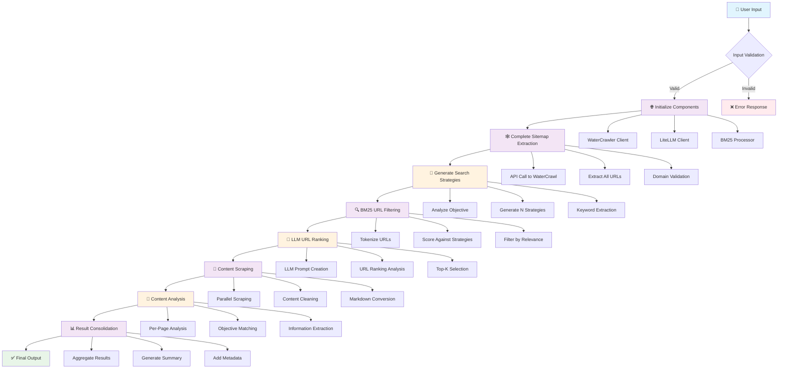

# 🚀 Comprehensive Workflow Diagram: URL and Objective Crawler

## 📋 Project Overview
**Goal-oriented web crawler that maps entire websites, filters relevant pages, and extracts specific information using AI**

---

## 🔄 Complete Workflow Architecture



---

## 🏗️ System Architecture Components

### 🔧 Core Components

| Component | Purpose | Technology |
|-----------|---------|------------|
| **ObjectiveCrawler** | Main orchestrator class | Python dataclass |
| **WaterCrawler** | Web scraping & sitemap extraction | WaterCrawl API |
| **LLMClient** | AI-powered analysis & ranking | LiteLLM (Multi-provider) |
| **BM25 Processor** | Keyword-based URL filtering | Rank-BM25 |

### 🔄 Data Flow Pipeline

```
📥 INPUT → 🗺️ MAPPING → 🔍 FILTERING → 📊 RANKING → 📄 SCRAPING → 🧠 ANALYSIS → 📋 OUTPUT
```

---

## 📊 Detailed Step-by-Step Workflow

### 🎯 Phase 1: Initialization & Input Processing
```
┌─────────────────────────────────────────┐
│ 1. USER INPUT VALIDATION                │
├─────────────────────────────────────────┤
│ • URL format validation                 │
│ • Objective string processing           │
│ • Parameter validation (top_k, etc.)   │
│ • Environment variable checks          │
└─────────────────────────────────────────┘
```

### 🌐 Phase 2: Complete Website Mapping
```
┌─────────────────────────────────────────┐
│ 2. SITEMAP EXTRACTION (WaterCrawl)      │
├─────────────────────────────────────────┤
│ • Single API call to get ALL URLs      │
│ • Domain boundary enforcement          │
│ • URL deduplication                    │
│ • Structure preservation               │
│                                        │
│ Output: List[str] of all site URLs     │
└─────────────────────────────────────────┘
```

### 🧠 Phase 3: AI-Powered Search Strategy Generation
```
┌─────────────────────────────────────────┐
│ 3. SEARCH STRATEGY GENERATION (LLM)     │
├─────────────────────────────────────────┤
│ • Analyze user objective               │
│ • Generate N diverse search strategies │
│ • Extract key terms & contexts         │
│ • Create fallback strategies           │
│                                        │
│ Example Strategies for "Find pricing": │
│ 1. "pricing"                          │
│ 2. "plans"                            │
│ 3. "cost"                             │
└─────────────────────────────────────────┘
```

### 🔍 Phase 4: BM25 Keyword Filtering
```
┌─────────────────────────────────────────┐
│ 4. BM25 URL FILTERING                   │
├─────────────────────────────────────────┤
│ • Tokenize all URLs                    │
│ • Initialize BM25 model                │
│ • Score URLs against strategies        │
│ • Filter by relevance threshold        │
│ • Rank by maximum scores               │
│                                        │
│ Input: 1000+ URLs → Output: ~50 URLs   │
└─────────────────────────────────────────┘
```

### 🤖 Phase 5: LLM-Based URL Ranking
```
┌─────────────────────────────────────────┐
│ 5. INTELLIGENT URL RANKING (LLM)        │
├─────────────────────────────────────────┤
│ • Analyze URL patterns & structures    │
│ • Consider web naming conventions      │
│ • Evaluate content type indicators     │
│ • Rank by objective relevance          │
│ • Select top-K URLs for scraping       │
│                                        │
│ Input: ~50 URLs → Output: ~10 URLs     │
└─────────────────────────────────────────┘
```

### 📄 Phase 6: Content Scraping & Processing
```
┌─────────────────────────────────────────┐
│ 6. CONTENT SCRAPING (WaterCrawl)        │
├─────────────────────────────────────────┤
│ • Parallel scraping of ranked URLs     │
│ • Content cleaning & normalization     │
│ • Markdown conversion                  │
│ • Error handling & retries             │
│ • Content length management            │
└─────────────────────────────────────────┘
```

### 🔬 Phase 7: AI Content Analysis
```
┌─────────────────────────────────────────┐
│ 7. CONTENT ANALYSIS (LLM)               │
├─────────────────────────────────────────┤
│ • Per-page objective matching          │
│ • Information extraction               │
│ • Relevance scoring                    │
│ • Key data identification              │
│ • Structured output generation         │
└─────────────────────────────────────────┘
```

### 📊 Phase 8: Result Consolidation
```
┌─────────────────────────────────────────┐
│ 8. FINAL RESULT GENERATION (LLM)        │
├─────────────────────────────────────────┤
│ • Aggregate all page analyses          │
│ • Synthesize comprehensive answer      │
│ • Add reference URLs                   │
│ • Generate structured JSON output      │
│ • Include metadata & statistics        │
└─────────────────────────────────────────┘
```

---

## 🔄 Process Flow with Decision Points

```
START
  ↓
[Input Validation] ──❌──→ [Error Response]
  ↓ ✅
[Sitemap Extraction] ──❌──→ [No URLs Found Error]
  ↓ ✅
[Strategy Generation] ──❌──→ [Fallback Strategies]
  ↓ ✅
[BM25 Filtering] ──❌──→ [No Matches Error]
  ↓ ✅
[LLM Ranking] ──❌──→ [Use BM25 Results]
  ↓ ✅
[Content Scraping] ──❌──→ [Partial Results]
  ↓ ✅
[Content Analysis] ──❌──→ [Raw Content Return]
  ↓ ✅
[Result Consolidation]
  ↓
[JSON Output] ──→ END
```

---

## 📈 Performance Characteristics

### 🎯 Efficiency Metrics
- **Sitemap Coverage**: 100% of discoverable URLs
- **Filtering Efficiency**: ~95% URL reduction via BM25
- **AI Ranking Accuracy**: Context-aware relevance scoring
- **Scraping Success Rate**: Robust error handling & retries

### ⚡ Scalability Features
- **Parallel Processing**: Concurrent scraping operations
- **Token Management**: Content truncation for LLM limits
- **Memory Optimization**: Streaming and chunked processing
- **API Rate Limiting**: Respectful API usage patterns

---

## 🛠️ Configuration & Customization

### 🎛️ Configurable Parameters
```python
@dataclass
class ObjectiveCrawler:
    top_k: int = 10                    # URLs to scrape
    num_search_strategies: int = 3     # Search diversity
    debug_mode: bool = False           # Verbose logging
    relevance_threshold: float = 0.1   # BM25 cutoff
```

### 🔧 Supported LLM Providers
- **OpenAI**: GPT-4, GPT-4o, O1, O3 series
- **Anthropic**: Claude 3/4 series
- **DeepSeek**: DeepSeek Chat/Coder
- **Groq**: High-speed inference
- **Cohere**: Enterprise solutions

---

## 📋 Output Format

### 🎯 Final JSON Structure
```json
{
  "objective_fulfilled": true,
  "final_answer": "Comprehensive extracted information...",
  "reference_urls": ["url1", "url2", "url3"],
  "pages_analyzed": 8,
  "successful_pages": 6,
  "_metadata": {
    "objective": "User's original objective",
    "base_url": "Starting website URL",
    "total_candidate_urls": 847,
    "ranked_urls_evaluated": 10,
    "search_strategies_used": 3,
    "individual_analyses": [...]
  }
}
```

---

## 🚀 Usage Examples

### 💼 Business Intelligence
```bash
python main.py https://company.com "Find pricing information"
```

### 🔧 Technical Documentation
```bash
python main.py https://api-docs.com "Find authentication methods" --debug
```

### 📊 Market Research
```bash
python main.py https://competitor.com "Find product features" --strategies 5
```

---

## 🎯 Key Success Factors

1. **🎯 Objective-Driven**: Every step optimized for user goals
2. **🧠 AI-Enhanced**: Multiple LLM integration points
3. **⚡ Efficient**: Smart filtering reduces processing overhead
4. **🔄 Robust**: Comprehensive error handling & fallbacks
5. **📊 Transparent**: Detailed metadata & debugging support
6. **🔧 Flexible**: Configurable for different use cases

---

*This workflow represents a state-of-the-art approach to objective-driven web crawling, combining traditional IR techniques (BM25) with modern AI capabilities (LLMs) for maximum effectiveness.*
